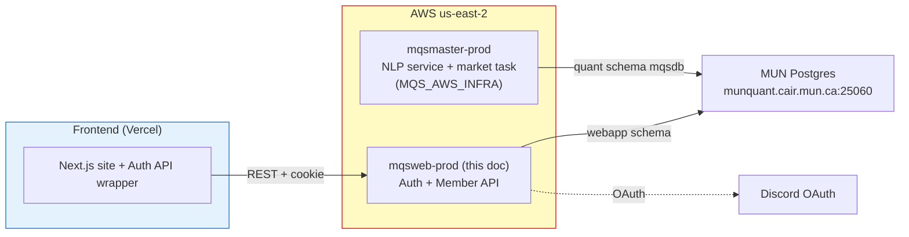
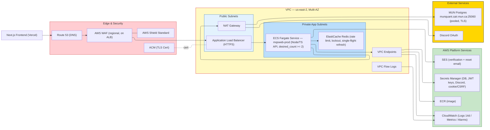
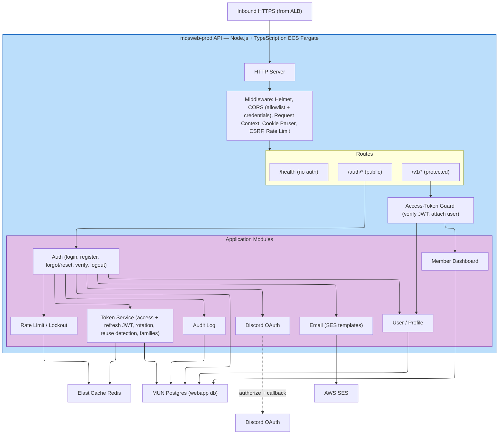
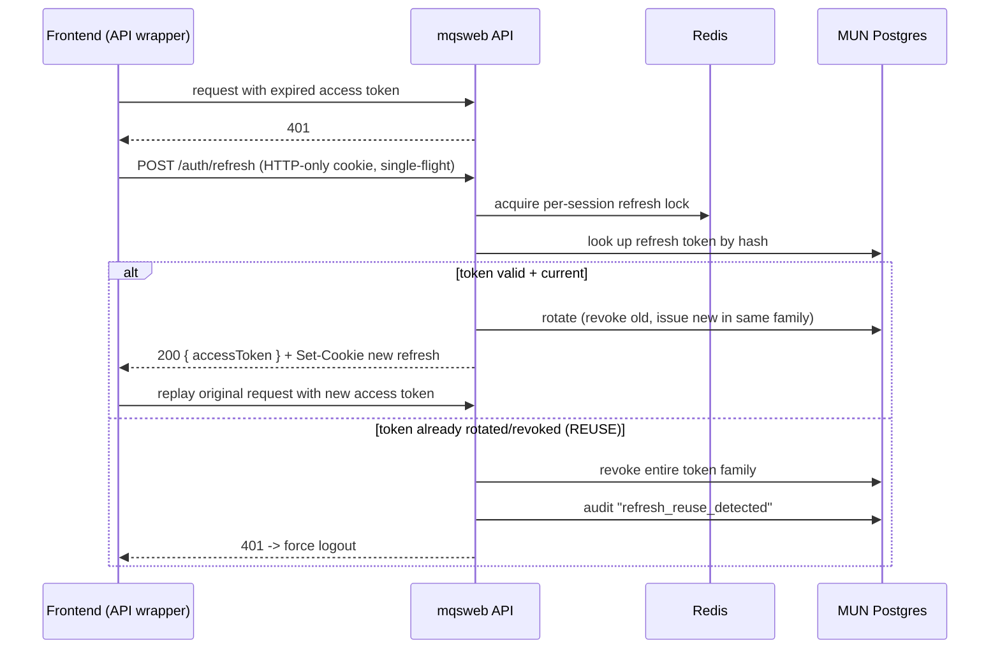

# MQS Web App — Backend Architecture Design Document

| | |
|---|---|
| **Service** | MQS Web App backend (`mqsweb-prod`) |
| **Platform** | AWS — ECS Fargate, `us-east-2` |
| **Scope** | Authentication system + authenticated member dashboard API |
| **Frontend** | Next.js (this repo), hosted on Vercel |
| **Status** | Design |
| **Last updated** | 2026-05-28 |
| **Owner** | koushik@clace.ai |
| **Auth flow source of truth** | [`docs/auth/`](./auth) |

---

## 1. Overview

The MQS Web App is a Next.js site (articles, events, team) currently served from Vercel. This document designs the **AWS backend** that adds member identity to it: a backend-authoritative authentication system (Discord-based registration, email/password login, silent refresh-token rotation, forgot-password, email verification) and an authenticated member dashboard API.

The backend is a stateless **Node.js + TypeScript** HTTP service running on **ECS Fargate behind an ALB**, following the same AWS conventions already established for the `MQSMaster` quant workloads in `MQS_AWS_INFRA` (Terraform module layout, ECR, Secrets Manager, CloudWatch, GitHub OIDC CI/CD, `us-east-2`, `<project>-<env>` naming).

Design priorities, drawn directly from [`docs/auth/README.md`](./auth/README.md):

- **Backend owns all security authority** — frontend validation is UX only.
- **Tokens are short-lived and purpose-scoped** — access tokens in memory, refresh tokens in HTTP-only cookies, rotated on every use with reuse detection.
- **Discord ID is the primary external identity**; email is globally unique.
- **No email enumeration, rate-limited everywhere, account lockout** on abuse.

### Relationship to existing systems



The quant backend (`mqsmaster-prod`) and the web backend (`mqsweb-prod`) are **independent services that share the same MUN-hosted Postgres server** but use **separate databases/schemas and DB users** (see [§7](#7-data-model)).

---

## 2. Goals & Non-Goals

### Goals
- Implement the full auth system specified in [`docs/auth/`](./auth): login, Discord register, email verification, forgot/reset password, refresh-token rotation.
- Backend-authoritative security: token issuance/validation, lockout, rate limiting, enumeration resistance — all server-side.
- Serve an authenticated member dashboard API (`/v1/*`).
- Reuse the existing MUN Postgres server (no new database server); isolate webapp data in its own database/schema and DB user.
- Match existing AWS conventions so this slots beside `mqsmaster-prod` operationally.

### Non-Goals (this revision)
- Public content (articles/events/team) stays in the Next.js frontend — **not** moved to a backend CMS.
- No payments, no LLM/search integrations (those belong to other products).
- Multi-region (single region `us-east-2`, multi-AZ within it).
- MFA, RBAC, device management, session dashboard — flagged as future in the auth docs.

---

## 3. Architecture Decisions (this revision)

| # | Decision | Choice | Rationale |
|---|---|---|---|
| D1 | Compute | **ECS Fargate + ALB** | Matches `MQS_AWS_INFRA` conventions; long-lived process suits HTTP-only cookies, OAuth callback, cached JWKS. |
| D2 | Database | **Reuse MUN Postgres** (`munquant.cair.mun.ca:25060`) | No new DB server; consistent with `mqsmaster`. Isolated in a **separate database/schema + least-privilege user**. |
| D3 | Language/framework | **Node.js + TypeScript** (NestJS or Fastify) | Shares types with the Next.js frontend; mature JWT/cookie/OAuth/Discord ecosystem; maps cleanly to the middleware model in the auth docs. |
| D4 | Backend scope | **Auth + member dashboard** | Public content remains on Vercel; backend owns identity + member-only data. |
| D5 | Shared state store | **ElastiCache Redis** *(net-new vs. existing infra)* | Rate-limit counters, login lockout, and single-flight refresh are cross-request state that **breaks across ≥2 Fargate tasks** if kept in-memory. See [§8](#8-shared-state--rate-limiting). |
| D6 | Transactional email | **AWS SES** | AWS-native, cheap, IAM-role auth (no static creds). Requires domain verification + production access. |

---

## 4. Infrastructure Architecture

> **Key difference from a typical 3-tier AWS design:** because the database is the **external** MUN Postgres (decision D2), there is **no RDS and no isolated DB subnet**. The database is reached like any other external dependency — outbound over TLS through the NAT Gateway.



### Network design

| Tier | Subnet | Contents | Inbound | Outbound |
|---|---|---|---|---|
| Public | Public subnets (≥2 AZ) | ALB, NAT Gateway | 443 from internet | internet |
| Private (app) | Private app subnets (≥2 AZ) | ECS Fargate tasks, ElastiCache | ALB SG only | VPC endpoints, NAT, Redis |

- **ALB is the only internet-facing resource**; tasks have **no public IP** (a change from `mqsmaster` tasks, which run in the default VPC with `assignPublicIp=ENABLED` — this service warrants a proper private-subnet VPC).
- **VPC endpoints** (ECR `api`+`dkr`, S3 gateway, CloudWatch Logs, Secrets Manager) keep AWS-service traffic off the NAT. SES is reached via the SES interface endpoint where available, otherwise via NAT.
- **NAT Gateway** carries the two genuinely-external dependencies: **MUN Postgres** and **Discord OAuth**.
- Security groups are reference-based: `ALB-SG → ECS-SG`, `ECS-SG → Redis-SG`. The MUN Postgres firewall must allow the **NAT Gateway's Elastic IP**.
- **VPC Flow Logs → CloudWatch** for audit (relevant given the auth attack surface).

---

## 5. Application Architecture



### Middleware chain (order matters)
1. **Helmet** — security headers.
2. **CORS** — allow-list of frontend origins (Vercel preview + production domains, localhost dev) with `credentials: true` (required for the refresh cookie).
3. **Request Context** — request ID / correlation ID + scoped logger; everything downstream logs with this ID.
4. **Cookie Parser** — reads the HTTP-only refresh cookie.
5. **CSRF protection** — required because refresh auth is cookie-based (double-submit token or origin check on state-changing routes). See cross-site note in [§9](#9-security).
6. **Rate Limit** — global per-IP + per-route, backed by Redis ([§8](#8-shared-state--rate-limiting)).

### Routes
- **`/health`** — unauthenticated, cheap liveness/readiness for the ALB target group. No DB/Discord/SES calls.
- **`/auth/*`** — public auth surface (see [§6](#6-authentication-flows)).
- **`/v1/*`** — protected member API behind the Access-Token Guard (`GET /v1/me`, member dashboard endpoints).

### Modules
| Module | Responsibility | Talks to |
|---|---|---|
| **Auth** | Orchestrates login, register, verify, forgot/reset, logout; applies lockout | Token, OAuth, Email, RateLimit, User, Audit, DB |
| **Token Service** | Issues/verifies access + refresh + purpose-scoped JWTs; rotation, single-use, family tracking, **reuse detection** | Redis, DB |
| **Discord OAuth** | OAuth authorize + callback; resolves `discord_id` / `discord_username` | Discord |
| **User / Profile** | Profile read/update, account status (active/suspended/verified) | DB |
| **Email** | SES-templated verification + reset emails | SES |
| **Rate Limit / Lockout** | Global + per-email throttling, failed-login lockout | Redis (DB backstop) |
| **Member Dashboard** | Authenticated member-only data | DB |
| **Audit Log** | Records suspicious auth events (failed logins, token reuse, reset requests) | DB |

---

## 6. Authentication Flows

All flows implement [`docs/auth/`](./auth). Two representative sequences below; login / forgot-password follow the same shape.

### 6.1 Discord registration + email verification

```mermaid
sequenceDiagram
  participant U as User
  participant FE as Frontend (Vercel)
  participant API as mqsweb API
  participant D as Discord
  participant DB as MUN Postgres
  participant SES as AWS SES

  U->>FE: Click Register
  FE->>API: GET /auth/discord
  API->>D: OAuth authorize (state)
  D-->>API: callback (code, state)
  API->>D: exchange code -> discord_id, username
  alt discord_id already registered
    API-->>FE: redirect /login ("Account already exists")
  else new identity
    API->>API: mint registration token (JWT, purpose=registration, 10-15m, single-use)
    API-->>FE: redirect /register/complete?token=...
    U->>FE: enter email, username, password
    FE->>API: POST /auth/register {token, email, username, password}
    API->>API: verify token (sig, exp, purpose, unused); validate email unique
    API->>API: hash password (argon2/bcrypt)
    API->>DB: insert user (is_verified=false)
    API->>API: mint email_verification token (single-use, hashed in DB)
    API->>SES: send verification email
    SES-->>U: verification link
    U->>FE: open /verify-email?token=...
    FE->>API: POST /auth/verify-email {token}
    API->>DB: mark verified, invalidate token
    API-->>FE: success -> /login (or auto-login)
  end
```

### 6.2 Silent refresh with rotation + reuse detection



**Token model** (from [`docs/auth/refresh-token`](./auth/refresh-token/README.md)):

| Token | Lifetime | Storage | Properties |
|---|---|---|---|
| Access | 5–15 min | client memory | JWT, `Authorization: Bearer`, short-lived |
| Refresh | days–weeks (longer if "Remember Me") | **HTTP-only, Secure, SameSite cookie** | rotated every use, single-use, **hashed in DB**, family reuse-detection |
| Registration | 10–15 min | URL (one-time) | purpose-scoped, single-use |
| Email verification | 15–30 min | URL (one-time) | purpose-scoped, single-use, hashed in DB |
| Password reset | 15–30 min | URL (one-time) | purpose-scoped, single-use, hashed in DB |

---

## 7. Data Model

A **separate database (or schema) and a dedicated least-privilege DB user** on the MUN Postgres server — isolated from the quant `mqsdb`. Suggested: database `mqswebdb` (or schema `webapp`), user `mqsweb_app` with rights only on those tables.

| Table | Key columns | Notes |
|---|---|---|
| `users` | `id` (uuid pk), `discord_id` (unique), `discord_username`, `email` (unique, lowercased/`citext`), `username`, `password_hash`, `is_verified`, `status` (active/suspended), `created_at`, `updated_at` | Discord ID is the permanent external identity |
| `refresh_tokens` | `id`, `user_id` fk, `family_id`, `token_hash` (unique), `issued_at`, `expires_at`, `rotated_at`, `revoked_at`, `replaced_by`, `ip`, `user_agent` | Rotation chain; presenting a rotated/revoked hash ⇒ revoke whole `family_id` |
| `auth_tokens` | `id`, `user_id` fk, `purpose` (registration/email_verification/password_reset), `token_hash`, `expires_at`, `used_at`, `created_at` | Single-use, purpose-scoped, stored hashed |
| `login_attempts` | `email`/`user_id`, `attempt_count`, `window_start`, `locked_until` | Durable lockout backstop; hot counters live in Redis |
| `audit_log` | `id`, `user_id` (nullable), `event`, `ip`, `user_agent`, `metadata` (jsonb), `created_at` | Suspicious-auth audit trail |

A future, separate `profiles` table is anticipated by the register doc to keep registration minimal and let the schema evolve.

---

## 8. Shared State & Rate Limiting

**This is the one net-new component beyond the existing `MQS_AWS_INFRA` pattern, and it matters.**

For high availability the service runs **≥2 Fargate tasks across AZs**. The auth design carries cross-request state that is wrong if held in process memory, because consecutive requests hit different tasks:

- **Rate-limit counters** (global per-IP, per-route).
- **Per-email lockout** (forgot-password allows 3 attempts / 15-min lock; login lockout after N failures).
- **Single-flight refresh** — the refresh doc requires "only one refresh in-flight at a time"; that lock must be shared, not per-task.

→ **ElastiCache Redis** holds these. Postgres remains the durable record (token families, lockout backstop); Redis holds the hot, short-TTL counters and locks. Running multiple tasks without it would let attackers bypass limits by spreading requests across tasks.

WAF adds a **coarse rate-based rule** at the edge as a first layer; Redis-backed app limits are the precise per-email/per-route layer.

---

## 9. Security

Implements the security requirements across the `docs/auth/` modules.

**Identity & tokens**
- Passwords hashed with **argon2id** (or bcrypt); never logged.
- Access tokens short-lived; refresh tokens rotated, single-use, **hashed at rest**, with **reuse detection → family revocation**.
- All token validation is server-side; frontend JWT decode is UX-only.
- Purpose-scoped JWTs for registration / verification / reset.

**Enumeration & abuse resistance**
- Forgot-password always returns the same 200 message — no email enumeration.
- Generic login errors ("Invalid email or password").
- Account lockout + layered rate limiting ([§8](#8-shared-state--rate-limiting)).
- Audit logging of suspicious events.

**Cookies & cross-site — important nuance**

The frontend is on **Vercel** and the API is on **AWS**. Cookie behavior depends on domains:

- **Recommended:** put both behind the **same registrable domain** — e.g. frontend at `mqs.example.ca` (custom domain → Vercel) and API at `api.mqs.example.ca` (Route 53 → ALB). The refresh cookie is then **first-party**; `SameSite=Lax` works and CSRF exposure is minimal.
- **If cross-site** (frontend on `*.vercel.app`, API on a different domain): the refresh cookie must be `SameSite=None; Secure`, CORS must echo the exact origin with `credentials: true`, and **CSRF protection is mandatory** on state-changing routes.
- Always: `HttpOnly`, `Secure` (production), short access-token TTL.

**Network & secrets**
- TLS everywhere: ACM cert at the ALB; `sslmode=require` to MUN Postgres; TLS to Redis (in-transit encryption) and SES.
- Secrets in **Secrets Manager** (DB creds, JWT signing keys, Discord client id/secret, cookie/CSRF secrets, token-hash pepper), injected as ECS task secrets — mirroring the `mqsmaster` `container_secrets` pattern.
- Least-privilege IAM task role (SES send, Secrets read, Logs write); separate execution role for image pull / secret injection.
- **Discord OAuth**: registered callback on the API domain; `state` parameter for OAuth CSRF.

---

## 10. High Availability & Scaling

- **Stateless tasks** (all shared state in Redis/Postgres) → horizontal scale; **`desired_count ≥ 2` across ≥2 AZs**.
- **ECS Service Auto Scaling** on CPU / `ALBRequestCountPerTarget`.
- **ALB health checks** on `/health`; unhealthy tasks drained and replaced.
- **ElastiCache**: Multi-AZ with automatic failover for production.
- **External dependency caveat:** availability and latency now depend on the **MUN Postgres** (outside AWS, reached over the internet) and **Discord**. The DB is effectively a single point of failure outside AWS control — see [§13](#13-open-questions--risks).

---

## 11. Observability

- **Logs** → CloudWatch `/ecs/mqsweb-prod`, structured JSON tagged with the correlation ID; **14-day retention** (matches existing convention).
- **Metrics** → ALB 5xx / latency / target health; ECS CPU-mem; Redis evictions/CPU; DB connection-pool saturation.
- **Security alarms** → spikes in `401`/`429`, `refresh_reuse_detected` audit events, login-lockout rate — these are attack signals, not just ops signals.
- **Tracing** → correlation ID now; OpenTelemetry / X-Ray later.

---

## 12. CI/CD, Deployment & Cost

**CI/CD** — mirror `MQS_AWS_INFRA/.github/workflows/deploy.yml`:
1. Build the TS image → push to **ECR** via **GitHub OIDC** (no static AWS keys).
2. Run DB **migrations** as a one-off ECS task before traffic shift (Drizzle / Prisma / Knex).
3. ECS rolling deploy behind the ALB; new tasks must pass `/health` before old tasks drain.
4. Roll back by redeploying the previous image tag.

**Terraform** — add a sibling stack (or new modules in the existing repo): `network` (real VPC w/ public+private subnets, NAT, endpoints — *not* the default-VPC module used by `mqsmaster`), `alb`, `ecs_service`, `elasticache`, plus reuse of `ecr` / `iam` / `secrets` / `logging` / `ecs_cluster` module shapes. Region `us-east-2`, names `mqsweb-prod`.

**Rough monthly cost** (low traffic, 2 small tasks):

| Component | Est. |
|---|---|
| Fargate (2 × 0.25 vCPU / 0.5–1 GB) | ~$15–25 |
| ALB (base + low LCU) | ~$18–22 |
| NAT Gateway (base + egress to DB/Discord) | ~$32 + data |
| ElastiCache (t4g.micro, or serverless) | ~$11–15 |
| Secrets Manager (≈3 secrets) | ~$1.20 |
| CloudWatch logs | ~$2–3 |
| SES | ~$0.10 / 1k emails |
| **Total** | **~$80–100/mo** |

NAT + ALB dominate. A **single NAT Gateway** (instead of per-AZ) and **ALB instead of CloudFront** keep it lean; VPC endpoints already divert AWS traffic off NAT. If cost pressure rises, a one-task non-HA dev posture or NAT instance can cut further.

---

## 13. Open Questions & Risks

1. **MUN Postgres is an external SPOF.** It sits outside AWS, reached over the internet via NAT. Risks: added per-query latency, connection limits (use the **pooled `:25060` endpoint** and a small per-task pool), the DB firewall must allow the **NAT Elastic IP**, and webapp availability is tied to MUN's uptime + network path. *If this becomes a bottleneck, an in-VPC RDS read/cache or full migration to RDS is the fix (decision D2 revisited).*
2. **Connection budget.** `tasks × pool_size` must stay under the DB's `max_connections`. Cap pool size per task; consider a shared pooler. Confirm the webapp gets its **own database/user**, not access to quant `mqsdb`.
3. **Cookie domain strategy (D5/§9).** Decide now whether frontend + API share a registrable domain. This choice drives `SameSite`, CORS, and CSRF design and is painful to change later.
4. **SES production access.** SES starts in **sandbox** (can only email verified addresses). Verify the sending domain (DKIM/SPF/DMARC) and request production access before launch, or verification/reset emails won't reach real users.
5. **JWT key strategy.** Symmetric (HS256, one secret) vs asymmetric (RS256/EdDSA, public key shareable for verification). Asymmetric is cleaner if other services ever verify these tokens.
6. **Frontend hosting.** Frontend stays on Vercel for now; if it later moves behind the same AWS edge, revisit the cookie/CORS model in §9.

---

## 14. Future Extensions

Aligned with [`docs/auth/README.md`](./auth/README.md) "Future Extensions":
- **MFA**, **RBAC** (roles already returned in the login payload), session-management dashboard, device management, account deletion.
- **Member dashboard pulling MQSMaster data** — surface quant/NLP outputs to verified members (read-only, via the shared DB or a `mqsmaster` API).
- **Token reuse analytics / alerting** beyond family revocation.
- **S3 Terraform backend + DynamoDB lock**, and per-environment workspaces (`dev`/`staging`/`prod`) — same future-work items noted in `MQS_AWS_INFRA`.
